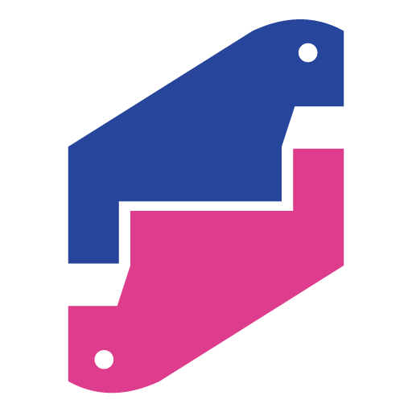
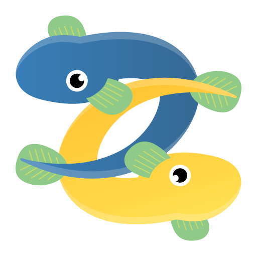

# pycon-jp-2020-tutorial
PyCon JP 2020 チュートリアルで利用する資料です

## このサイトは?
PyCon JP 2020 チュートリアル「Pythonの開発エコシステムを学ぼう Slack Bot編」の当日資料とサポートページです

## 開催情報

- 日時: 8/30（日）
- 開催時間: 10:00〜17:00（7時間）
- connpassイベントページ
    - [PyCon JP 2020 Tutorial（Zoom参加） - connpass](https://pyconjp.connpass.com/event/181065/) 
    - [PyCon JP 2020 Tutorial （YouTube Live視聴のみ） - connpass](https://pyconjp.connpass.com/event/182390/)

## 開催コミュニティ

Python駿河

Unagi.py

## 資料の内容

- tutorial_docs: チュートリアルのドキュメントになります。ステップバイステップで解説しています
- ＊＊＊: チュートリアルで扱うソースコード, テストコード, Slackbotのドキュメントがあります
- その他: ＊＊＊

## 謝辞

このドキュメントの作成にあたっては以下の＊＊にご協力いただきました。この場をお借りして感謝申し上げます。

- ＊＊＊
- ＊＊＊