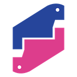
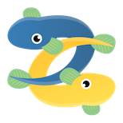

========================================
py-suruga pycon-jp-2020-tutorial
========================================

このサイトは?
========================================

PyCon JP 2020 チュートリアル「Pythonの開発エコシステムを学ぼう Slack Bot編」の当日資料とサポートページです

開催情報
========================================

- 日時: 8/30（日）
- 開催時間: 10:00〜17:00（7時間）
- connpassイベントページ

    - `PyCon JP 2020 Tutorial（Zoom参加） - connpass <https://pyconjp.connpass.com/event/181065/>`_
    - `PyCon JP 2020 Tutorial （YouTube Live視聴のみ） - connpass <https://pyconjp.connpass.com/event/182390/>`_

担当コミュニティ
========================================

`Python駿河 <https://py-suruga.connpass.com/>`_

`Unagi.py <https://unagi-py.connpass.com/>`_

当日利用するドキュメント
========================================

.. image:: https://readthedocs.org/projects/pycon-jp-2020-tutorial-slackbot/badge/?version=latest

:target: https://pycon-jp-2020-tutorial-slackbot.readthedocs.io/ja/latest/?badge=latest
:alt: Documentation Status

資料の内容
========================================

- tutorial_docs: チュートリアルのドキュメントになります。ステップバイステップで解説しています
- pt_slackbot_sample: チュートリアルで扱うソースコード, テストコード, Sphinxの例で扱うSlackbotのドキュメントがあります
- pt_slackbot: チュートリアルで実際に作業をするディレクトリです。最初に作業をするファイルが入っています

Contributors
========================================

このドキュメントの作成にあたっては以下の方々にご協力いただきました。この場をお借りして感謝申し上げます。

- Python駿河, Unagi.py

    - Nakanishi（b7craft: レビュー、当日TA）
    - Nakai（Nakaishi_j: 当日TA）
    - yoshi_corleone（レビュー）
    - Y.Hatake

- PyCon JP チュートリアルスタッフ皆様

    - @huideyeren（ドキュメント修正）

- レビュー感謝

  - @takanory
