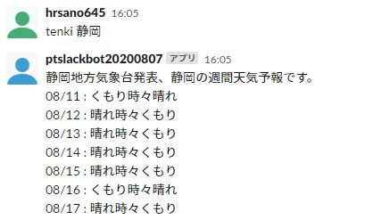

==============================
SlackBotの使いかた
==============================

このドキュメントではpt_SlackBotの使い方を解説します。

SlackBotは3つの機能があります。

- wgreet: 世界の挨拶をランダムで返すbot
- connpassonline: connpassで ``Python``, ``オンライン`` の検索結果を返すbot
- tenki: 気象庁XMLサービスから地域の週間天気予報を返すbot

wgreet: 挨拶bot
==================================

世界のあいさつをランダムで返してくれます。

現在対応している国は以下の通りです。

- 日本🇯🇵
- アメリカ🇺🇸
- 中国🇨🇳

利用イメージ
--------------------------------

.. image:: img/slackbot_aisatu.jpg

コマンドの入力方法
--------------------------------

.. code-block:: none

    wgreet

connpassonline: connpass検索bot
==================================

Connpass から 「Pyhton」と「オンライン」のキーワードでマッチする結果を最大20件返してくれます。

年月の指定が必須で、指定した年月で開催されるイベントを検索します。

利用イメージ
--------------------------------

.. image:: img/slackbot_connpassonline.jpg

コマンドの入力方法
--------------------------------

.. code-block:: none

    connpassonline yyyymm

    # 例

    connpassonline 202008

tenki: 天気bot
==================================

地域を指定すると、気象庁XMLサービスから週間天気予報を返してくれます。

利用イメージ
--------------------------------

コマンドの入力方法
--------------------------------

.. code-block:: none

    tenki 静岡

各botのリファレンス
==============================

こちらから参照できます。

:doc:`./botrun`

:doc:`./botfunc`