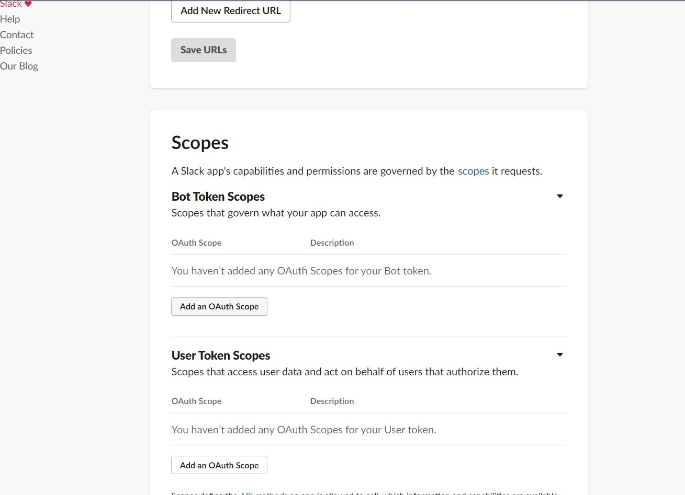
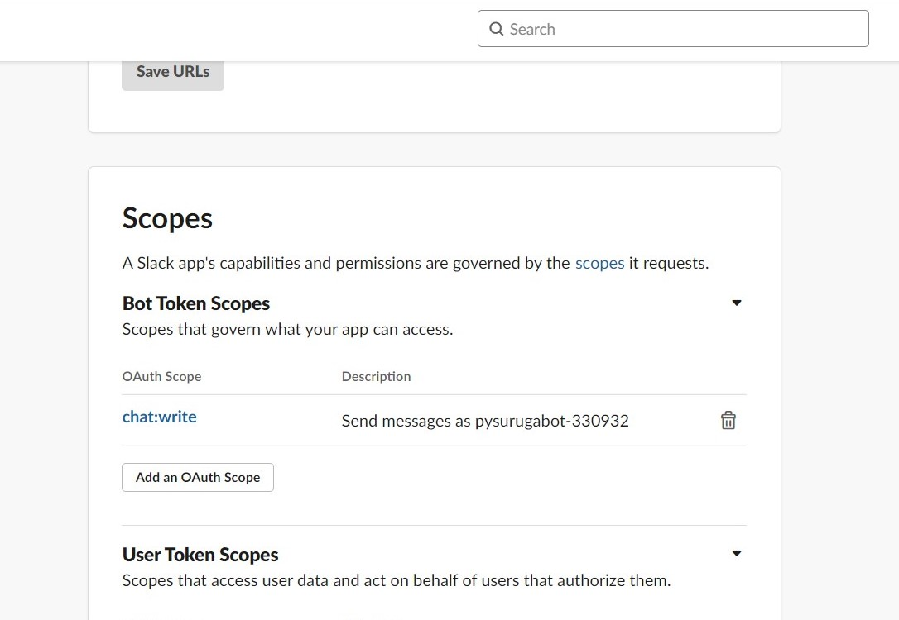
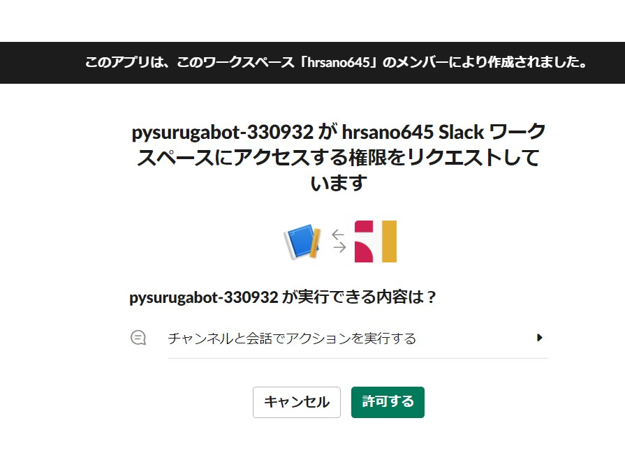
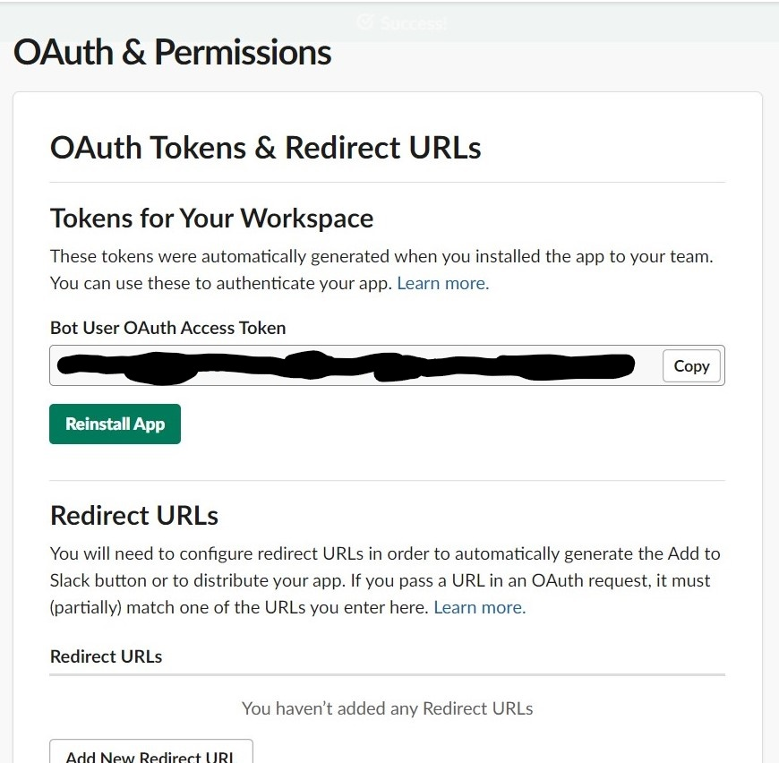
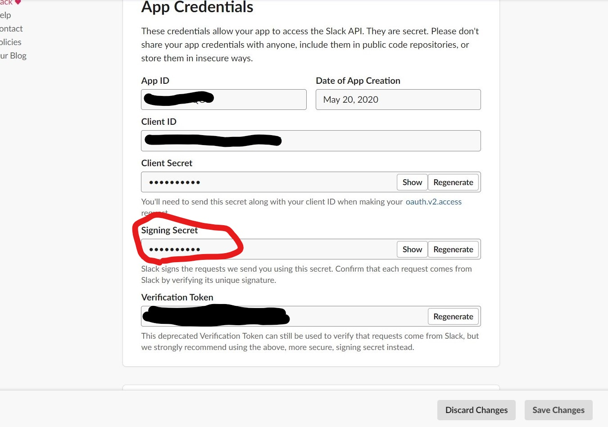

================================================================================
Slackbotの作成
================================================================================

チュートリアルで扱うSlackbotを実装します。

Slackアプリの作成と設定
================================================================================

まず初めにBotとなるSlackアプリをSlack上で作成します。

「Create a Slack App」からApp Nameにアプリ名を入力します。（このアプリ名はHerokuのアプリ名でも利用します。

.. image:: ./doc-img/slackapp1.jpg

Slack WorkSpaceはハンズオン用に新たに取得したワークスペースを利用してください。

アプリが作成できたら、「OAuth & Permissions」の「Scopes」>「Bot Token Scopes」にスコープの設定を行います。

「Bot Token Scope」はBotとなるSlackアプリがSlackワークスペースに利用できる権限の範囲（スコープ）です。

この時点では`chat:write`のみで、botがSlackへメッセージを送るためのスコープのみを設定していますが、後ほどの設定で、いくつか追加されます。

追加したら、ページの上にある「Install App to Workspace」をクリックし、SlackアプリをSlackワークスペースへ追加します。

.. image:: ./doc-img/slackapp4.jpg

追加が終わると、「Bot User OAuth Access Token」が表示されます。このトークンをまず控えてください。

次に、右上の「Basic Information」へ戻り、「App Credentials」の中にある「Signing Secret」を控えます。

.. 
    - この後、サンプルアプリを使って権限までを動作させれるかをミル
    - サンプルアプリはeventメッセージを取ってdebug結果を返すような関数のみ

slackbotのフロー
---------------------------------------------------------------------------------

..
    - slackbotのシステム概要を説明: どんな技術が利用されているか。ざっくりで。(pysuruga-13-handsonの資料流用）

チュートリアルで実装するslackbotについて
================================================================================

このチュートリアルでは、三つのslackbotを実装します。人口無能的な挨拶を返すbotから、APIを利用してインタラクティブな結果を返すようにします。

世界の挨拶を返すbot
--------------------------------------------------------------------------------

.. 
    - 挨拶を返すbot: （国ごとの言葉で返したらその国ごとに返す機能）-> 目的:人口無能をまずは試してもらう
        - 各国の言葉でのあいさつ、挨拶の返しをまとめたデータ構造を用意する
        - こんにちは（昼の挨拶）のみにする
        - 英語, 中国,など5つぐらいの言語の挨拶をコメントアウトで用意。参加者に選んで実装してもらう
        - もちろん自由に言葉を変えてもらっても良し

気象庁のXML電文を使って地域の天気を返すbot
--------------------------------------------------------------------------------

気象庁のXML電文を利用した週間天気予報を返すbotです。

動作するソース: （ソースのパス）

STEP1: 

.. 
    - 気象庁のXML電文を利用した週間天気予報を答えるbot -> 目的:人間に一番実用的な情報を聞く機能の作成
        - 気象庁のXMLで見れる週間天気予報を地域別に対応させる。最初は東京と静岡
        - 間のコードについては解説のみに務める（
        - これも参加者が自由に変更できるようにしておく。 理想はすべての地域の一覧があること

connpass APIを利用してオンラインイベントを検索するbot
--------------------------------------------------------------------------------

.. 
    - connpass API でオンラインイベント検索を行うbot（予定）-> 目的:ITエンジニアに身近なサービス（少なくとも参加者全員知っているはず）で体験する
        - connpass APIでオンラインイベント検索が可能かを調べる -> 別issue ->（軽く調べたら、検索自体では絞れず、レスポンス結果のフィールドで調べたほうがよさそう）
        - このbotは、実用性あるよねってことで、さらっと進めるw

.. 
    - Slackアプリとしてのセットアップをする
    - 権限回りはセットアップを先にして、あとで説明する（順番通りに進めて、その順番で解説する）
    - チュートリアルで動作するSlackbotの概要説明: （API利用は今のところの想定です）
    - slackbotのシステム概要を説明: どんな技術が利用されているか。ざっくりで。(pysuruga-13-handsonの資料流用）
    - 挨拶を返すbot: （国ごとの言葉で返したらその国ごとに返す機能）-> 目的:人口無能をまずは試してもらう
        - 各国の言葉でのあいさつ、挨拶の返しをまとめたデータ構造を用意する
        - こんにちは（昼の挨拶）のみにする
        - 英語, 中国,など5つぐらいの言語の挨拶をコメントアウトで用意。参加者に選んで実装してもらう
        - もちろん自由に言葉を変えてもらっても良し
    - Livedoor天気API で天気を聞いたら答えるbot -> 目的:人間に一番実用的な情報を聞く機能の作成
        - Livedoor 天気API側の地域情報（APIで呼び出す地域IDとセット）が良くつかわれているものかを確認して、そうでないなら、対応表を用意（マッピングする）
        - これも参加者が自由に変更できるようにしておく。 理想はすべての地域の一覧があること
    - connpass API でオンラインイベント検索を行うbot（予定）-> 目的:ITエンジニアに身近なサービス（少なくとも参加者全員知っているはず）で体験する
        - connpass APIでオンラインイベント検索が可能かを調べる -> 別issue ->（軽く調べたら、検索自体では絞れず、レスポンス結果のフィールドで調べたほうがよさそう）
        - このbotは、実用性あるよねってことで、さらっと進めるw