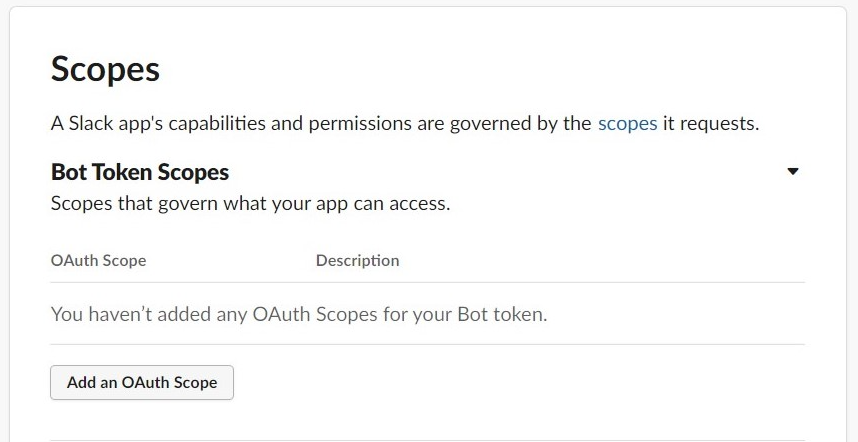
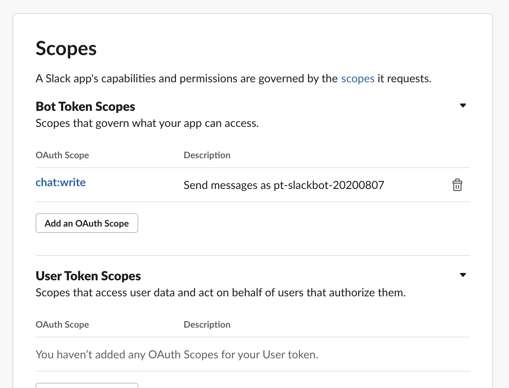
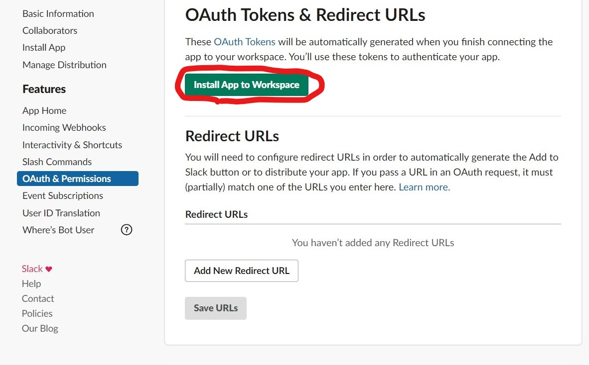
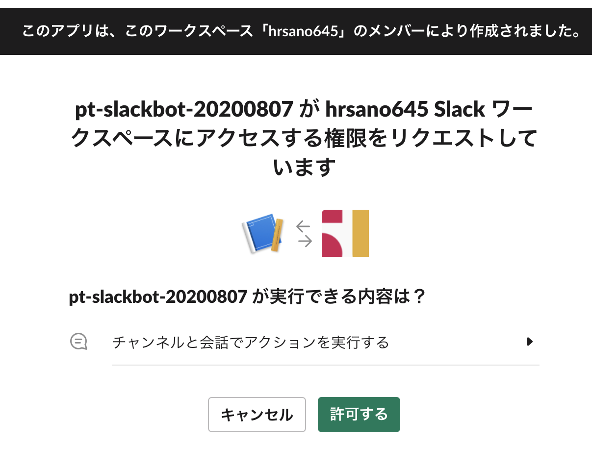
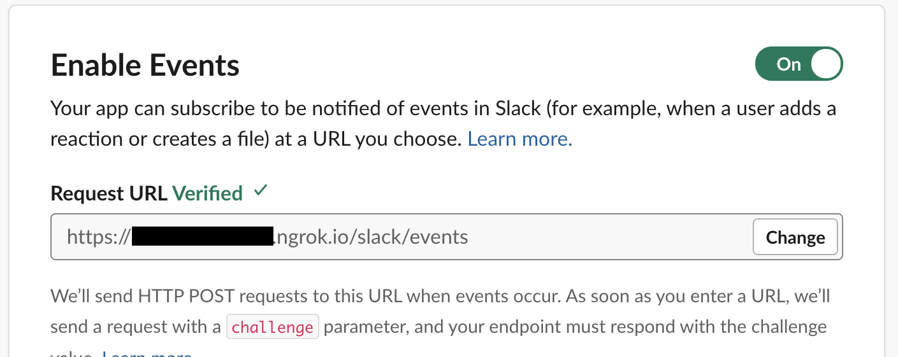
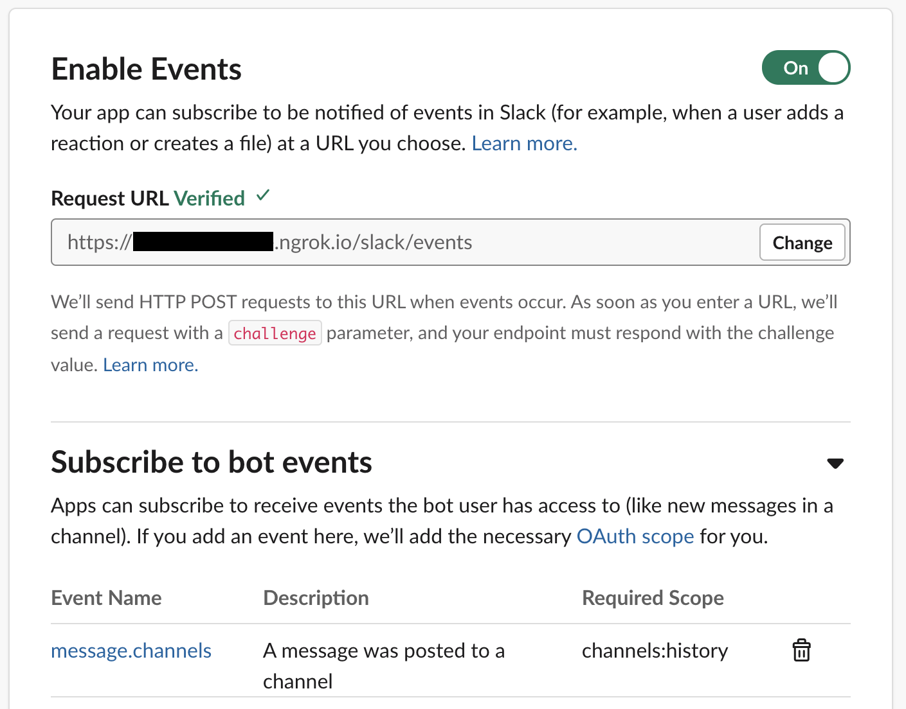
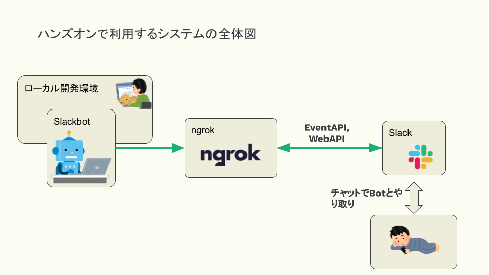

================================================================================
Slackbotの作成
================================================================================

チュートリアルで扱うSlackbotを実装するために、開発環境やSlackのAPI利用方法を説明し、ステップを踏みながらbotを作成していきましょう。

Slackアプリの作成と設定
================================================================================

まず初めにBotとなるSlackアプリをSlack上で作成します。

`こちらのリンク <https://api.slack.com/apps?new_app=1>`_ からアプリ作成画面に進みます。

.. image:: ./doc-img/slackbot_1-1.png

アプリ名はこの例では ``pt_slackbot-20200807`` としていますが、アプリ名については自由に変更可能です。

アプリが作成できたら、「OAuth & Permissions」の「Scopes」>「Bot Token Scopes」にスコープの設定を行います。

「Bot Token Scope」はBotとなるSlackアプリがSlackワークスペースに利用できる権限の範囲（スコープ）です。

この時点では ``chat:write`` のみで、botがSlackへメッセージを送るためのスコープのみを設定していますが、後ほどの設定で、いくつか追加されます。

追加したら、ページの上にある「Install App to Workspace」をクリックし、SlackアプリをSlackワークスペースへ追加します。

追加が終わると、「Bot User OAuth Access Token」が表示されます。このトークンをまず控えてください。

.. image:: ./doc-img/slackbot_1-6.png

次に、右上の「Basic Information」へ戻り、「App Credentials」の中にある「Signing Secret」を控えます。

.. image:: ./doc-img/slackbot_1-7.png

先程集めた2つのトークンをローカル開発環境の環境変数として登録します。

.. code-block:: none

    # Windows10: PowerShell

    > $env:SLACK_BOT_TOKEN = "XXXXXXXXXXXXXXXXXXXXXXXX"
    > $env:SLACK_SIGNING_SECRET = "XXXXXXXXXXXXXXXXXXXXXXXXXX"

    # macOS
    > export SLACK_SIGNING_SECRET=XXXXXXXXXXXXXXXXXXXXXXXX
    > export SLACK_BOT_TOKEN=XXXXXXXXXXXXXXXXXXXXXXXXXX

.. note::
    Windows10はスタートメニューから「環境変数を編集」と検索するとGUIから設定可能です。コマンドプロンプトの場合はSETコマンドを利用してください。

次にngrokコマンドを使い、SlackBotを外部公開します。

まずは以下のngrokコマンドを実行して、内部では3000ポートのhttpサービスをngrokの公開URLへ登録します。

.. code-block:: none

    # Windows 10の場合
    (.venv) pycon-jp-2020-tutorial$ ngrok.exe http 3000

    # macOSの場合
    (.venv) pycon-jp-2020-tutorial$ ngrok http 3000

ngrokコマンドを起動すると以下のような情報が表示されます。ngrokのサービスへサインアップしていない場合は外部公開のセッションは8時間の限定公開になります。

.. code-block:: none

  ngrok by @inconshreveable                                                                                                                       (Ctrl+C to quit)

  Session Status                online
  Session Expires               7 hours, 58 minutes
  Version                       2.3.35
  Region                        United States (us)
  Web Interface                 http://127.0.0.1:4040
  Forwarding                    http://df702078ccde.ngrok.io -> http://localhost:3000
  Forwarding                    https://df702078ccde.ngrok.io -> http://localhost:3000

  Connections                   ttl     opn     rt1     rt5     p50     p90
                                0       0       0.00    0.00    0.00    0.00

Web InterfaceのURLへアクセスすると、公開したURLのアクセス履歴が見れるようになります。

.. image:: ./doc-img/slackbot_1-8.png

次にslackbotを起動します。チュートリアル開始当初は、``pt_slackbot`` ディレクトリには ``botrun.py`` ファイルのみがあります。こちらをpythonコマンドで実行します。

このときにngrokコマンドを実行しているターミナルとは別のターミナルを使い起動してください。

.. code-block:: none

    python ./pt_slackbot/botrun.py

SlackBotがSlackワークスペースへのやりとりをおこなうURLを生成して、bot側と連携させたので、Slackアプリの設定を続けます。

Slack Events APIを使い、Slackワークスペース上に起きたイベントを、Slackbotが動作するサーバー（ここではngrokで公開しているローカル環境）へ伝えることができます。ここで2つの設定を行います。

1. Slack Event APIがイベント情報を送る先となるエンドポイントURL
2. イベントの種類

Slack Events APIが起きたイベントをサーバーに伝えるためのエンドポイントURLを設定します。

（このEvents APIのエンドポイントURLについての説明は後半で後述します）

「Event Subscriptions」ページの「Enable Events」にある、右上のボタンをOnにします。

「Request URL」にエンドポイントURLを設定します。ngrokのアプリ上でbotアプリが待機しているアドレスを入力します。

::

    https://[ngrokが自動的に割り振るランダムな文字列].ngrok.io/slack/events

次に、イベントの種類を登録します。イベントには種類があり、あらかじめアプリで取得したいイベントの種類を登録する必要があります。

Slackアプリのスコープを扱ったときに、イベントによるスコープの決定もあると書きましたが、このイベントを登録することでスコープの変化があります。

「Event Subscriptions」の「Subscribe to bot events」内に ``message.channels`` イベントを登録します。

登録後はSlackワークスペースへアプリの再インストールを指示されるので行います。

.. image:: ./doc-img/slackbot_1-11.png

再インストール時の認証画面を見ると、権限が追加されていることがわかります。先ほどはチャンネルにメッセージを送信するだけでしたが、それに加えてチャンネル内のメッセージを見ることができます。

.. image:: ./doc-img/slackbot_1-11-1.png

デプロイとSlackアプリの権限の設定が終わると、Slackbotが利用できます。最後にSlackワークスペース上でbotを呼び出してみます。

最初に、チャンネルにbotユーザーを追加します。

.. image:: ./doc-img/slackbot_1-12-0.png

.. image:: ./doc-img/slackbot_1-12-1.png

ここまででSlackBotを動作させる準備が整いました。

SlackBotのフロー
---------------------------------------------------------------------------------

ここでは、SlackBotがどのようにslackワークスペースとやり取りを行うか解説します。

SlackbotはWEBで扱われている技術でサービスとbotのアプリがやり取りを行います。今回のはSlack公式で提供されているEvents APIとWeb APIの2つを利用します。

Events APIはSlack側がbotアプリに声をかけるイメージで、Slackワークスペース内で起きたイベントを伝えます。

Web APIはSlackワークスペースに対して何らかのアクションを起こすために使います。botならbot側が何らかのメッセージを送ります。

PythonではEvents API, Web APIどちらとも対応した公式パッケージがあります。チュートリアルではどちらとも利用しています。

- Events API: https://github.com/slackapi/python-slack-events-api
- Web API: https://github.com/slackapi/python-slackclient

またBotはSlack側からのイベント内容をEvents API経由で随時受け取るためにAPIサーバーのような挙動を取ります。そのためWEBフレームワークのFlaskもインストールされます。

Slackbotのコード内ではFlaskのインスタンスを作成して、サーバーとして動作するようになり、Slack側にはエンドポイントURLを教えることで、botがSlackのイベントを知ることができるようになります。

.. note:: SlackのAPIはほかにもあります。
    代表例はincoming webhook（URLにパラメーターを付与するとslackワークスペースにメッセージを送れる）, RealTime Messeging API(websocketを利用したリアルタイムにSlackワークスペースとアプリがやり取り可能）になります。

    今回はそれらについては解説しませんが、参考情報を残します。

    - `Sending messages using Incoming Webhooks | Slack <https://api.slack.com/messaging/webhooks>`_
    - `Real Time Messaging API | Slack <https://api.slack.com/rtm>`_
    - `必要な Slack API はどれ？ - Slack アプリの作成のためのヒント | Slack <https://api.slack.com/lang/ja-jp/which-api>`_

.. note:: 8/7にSlackの新しいAPIライブラリとして、 Bolt for Pythonがアルファバージョンとしてリリースされています。
    `bolt-js <https://github.com/slackapi/bolt-js>`_ というnode.jsで動作するライブラリのPythonバージョンとなります。

    アルファバージョンのライブラリであるためチュートリアルでは扱いませんが、最新のAPI仕様にも対応していくようなのでSlackbotを扱うときやSlackbotを作るサードパーティライブラリで使われるようになるのではと思います。

    `slackapi/bolt-python: WIP: A framework to build Slack apps using Python (still in alpha) <https://github.com/slackapi/bolt-python>`_

休憩1🍪
===============

このあたりで休憩しましょう。休憩のお菓子はありますか？無ければ急いで用意しましょう！ 長いチュートリアルなので、無事に作業が終わったら自分へご褒美を！

.. image:: ./doc-img/oyatu-1.jpg

チュートリアルで実装するSlackBotについて
================================================================================

このチュートリアルでは、3つのSlackBotを実装します。人工無能な挨拶を返すbotから、APIを利用してインタラクティブな結果を返すようにします。

世界の挨拶をランダムで返す  **wgreet** bot
--------------------------------------------------------------------------------

.. image:: ./doc-img/slackbot_1-13.jpg

このbotは定義した挨拶情報をランダムに返すbotです。よく言われる人工無能をまずは試してもらいます。

このbotの趣旨は以下になります。

  - 国旗、挨拶の言葉、のテーブルを用意してテーブルからランダムに挨拶をかえす
  - 英語、中国、など5つぐらいの言語の挨拶をコメントアウトで用意。参加者に選んで実装してもらう
  - もちろん自由に言葉を変えてもらっても良し

挨拶botの実装ステップ
~~~~~~~~~~~~~~~~~~~~~~~~~~

  1. slackevetsapiのexampleをそのまま乗せておいて、そのbotで受け答えできるか確認します。
  2. 次に、その中でテーブルを作って、ランダムで返す関数を用意
  3. 最後に挨拶をかえす部分をモジュール化する

利用する資料:

- `pycon-jp-2020-tutorial/tutorial_docs/step/slackbot-1 <https://github.com/py-suruga/pycon-jp-2020-tutorial/tree/master/tutorial_docs/step/slackbot-1>`_
- `pycon-jp-2020-tutorial/tutorial_docs/step/slackbot-2 <https://github.com/py-suruga/pycon-jp-2020-tutorial/tree/master/tutorial_docs/step/slackbot-2>`_
- `pycon-jp-2020-tutorial/tutorial_docs/step/slackbot-3 <https://github.com/py-suruga/pycon-jp-2020-tutorial/tree/master/tutorial_docs/step/slackbot-3>`_

connpass APIを利用してオンラインイベントを検索する **connpassonline** bot
--------------------------------------------------------------------------------

ここではconnpassを例にイベント検索用のREST APIを使ってイベントの検索を行います。

チュートリアルでは「Python」と「オンライン」というキーワードを元に検索をした結果を20件一覧に表示する機能を実装しています。

.. image:: ./doc-img/slackbot_1-14.jpg

コマンドの実行方法は ``connpassonline [yyyymm]`` と入力します。yyyymmは年月の意味で、 ``connpassonline 202008`` と入力すると、2020年8月に関係する、Python, オンラインをキーワードにした検索結果が表示されます。

このbotの趣旨は以下になります。

  - requests + jsonでAPIから取得したjsonのパースを体験する

connpassonlinebotの実装ステップ
~~~~~~~~~~~~~~~~~~~~~~~~~~~~~~~~~~~~~~~~~~~~~~~~~~~~

1. 共通化した手法を元に、connpassonline botを作る。最初は1関数に処理をすべて入れています。
2. APIリクエストとbotの答えを返す関数をそれぞれで呼び出せるように分離します。

利用する資料:

- `pycon-jp-2020-tutorial/tutorial_docs/step/slackbot-4 <https://github.com/py-suruga/pycon-jp-2020-tutorial/tree/master/tutorial_docs/step/slackbot-4>`_
- `pycon-jp-2020-tutorial/tutorial_docs/step/slackbot-5 <https://github.com/py-suruga/pycon-jp-2020-tutorial/tree/master/tutorial_docs/step/slackbot-5>`_

気象庁のXML電文を使って地域の天気を返す **tenki** bot
--------------------------------------------------------------------------------

.. image:: ./doc-img/slackbot_1-15.jpg

最後にスマートスピーカーでも尋ねる率が高い機能でもある、天気予報を教えてくれるbotを作りましょう。

今回は誰でも無料で利用可能な、気象庁のXML電文を利用した週間天気予報を返すbotを作ります。XMLを扱うため、XMLのパーサーを使いながら、知りたい地域の週間天気予報を実装しましょう。

このbotは ``tenki [地域名]`` と入力します。 ``tenki 静岡`` と入力すると、静岡県気象台発表の週間天気予報を表示します。

このbotの趣旨は以下になります。

- BeautifulSoup4を使ってxmlを取得しパースを体験する

tenkibotの実装ステップ
~~~~~~~~~~~~~~~~~~~~~~~~~~

1. BeautifulSoup4を使ってxmlのパースをする
2. 対応地域を追加してbotの拡張をしてもらう

利用する資料:

- `pycon-jp-2020-tutorial/tutorial_docs/step/slackbot-6 <https://github.com/py-suruga/pycon-jp-2020-tutorial/tree/master/tutorial_docs/step/slackbot-6>`_

.. note:: 今回の天気情報の元は気象庁が無料で公開しているxmlファイルを利用しました。
    当初はLivedoor 天気から提供されている REST APIを用いる予定でしたが、 2020/7/31にサービスが終了となったため、急遽気象庁XMLサービスを利用しています。

    `天気情報 ヘルプ - livedoor ヘルプ <https://help.livedoor.com/weather/index.html>`_

    気象庁XMLサービスは天気予報以外にも、多数の予報や災害情報の提供もされているので、より多彩なbot作成ができると思います。
    ただxmlを扱うのは少し複雑です。

    `先端IT活用推進コンソーシアム <https://aitc.jp/>`_ が公開している `気象庁防災情報 XML 検索 API <http://api.aitc.jp/jmardb-api/help>`_ では気象庁のXMLデータを元にしたREST APIを公開しています。このAPIはxmlではなくjson形式が扱えます。

休憩2🍱
===============

このあたりでお昼しましょう。この章でSlackbotの作成はひと段落です。この先はPythonで扱われる開発を便利にするツールを紹介します。

まだまだ半分を過ぎたところです。お昼🍱休憩にして後半も頑張りましょう👍
