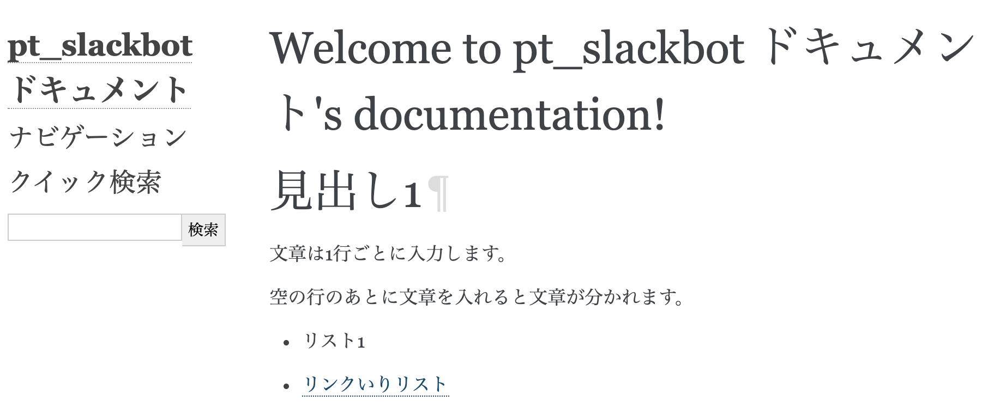
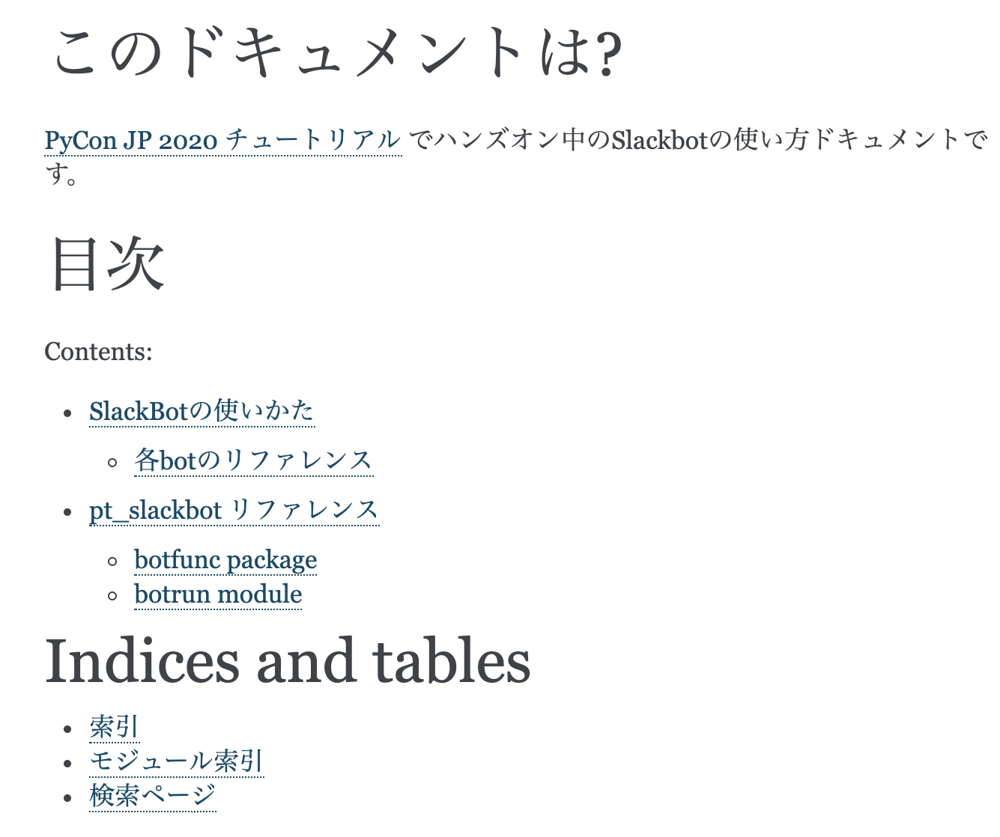

================================================================================
Sphinxでドキュメントを書こう
================================================================================

SphinxはPythonの公式ドキュメントやサードパーティライブラリ、またほかの言語や書籍にも利用されるドキュメンテーションツールです。HTMLやPDFでドキュメントを生成できます。

公式サイト: `Overview — Sphinx 4.0.0+ documentation <https://www.sphinx-doc.org/en/master/>`_

日本語版の公式サイト: `概要 — Sphinx 4.0.0+/ba0e5d0ec ドキュメント <https://www.sphinx-doc.org/ja/master/>`_

Sphinxはドキュメントの書きやすさや豊富な拡張、テーマが利用できます。オープンソースプロジェクトのドキュメントや、企業内のドキュメントでも利用されています。

今回はSlackbotのドキュメントを作りましょう。以下のドキュメントの作成を体験します。

- Slackbotの使い方ドキュメントを用意する
- autodoc拡張機能を使って、bot関数のリファレンスを作成する

Sphinxの始め方
============================

- sphinx-quickstartでひな形的なドキュメントの構成を用意する

Sphinxもローカル開発環境を作成した段階でインストールされています。もしsphinx-quickstartというコマンドが見つからない場合はpipコマンドでインストールします。

::

    pip install -U Sphinx

Sphinxはドキュメントを作成するひな形の環境を用意する ``sphinx-quickstart`` コマンドがあります。こちらを利用してひな形を作りましょう

.. code-block:: none

    (pycon-jp-2020-tutorial) PS C:\Users\hiroshi\Documents\workspace\personal\pycon-jp-2020-tutorial\pt_slackbot> sphinx-quickstart.exe .\docs\
    Welcome to the Sphinx 3.1.2 quickstart utility.

    Please enter values for the following settings (just press Enter to
    accept a default value, if one is given in brackets).

    Selected root path: .\docs\

    You have two options for placing the build directory for Sphinx output.
    Either, you use a directory "_build" within the root path, or you separate
    "source" and "build" directories within the root path.
    > Separate source and build directories (y/n) [n]: n

    The project name will occur in several places in the built documentation.
    > Project name: pt_slackbot ドキュメント
    > Author name(s): Hiroshi Sano
    > Project release []: 2020.07.24

    If the documents are to be written in a language other than English,
    you can select a language here by its language code. Sphinx will then
    translate text that it generates into that language.

    For a list of supported codes, see
    https://www.sphinx-doc.org/en/master/usage/configuration.html#confval-language.
    > Project language [en]: ja

    Creating file C:\Users\hiroshi\Documents\workspace\personal\pycon-jp-2020-tutorial\pt_slackboCreating file C:\Users\hiroshi\Documents\workspace\personal\pycon-jp-2020-tutorial\pt_slackboCreating file C:\Users\hiroshi\Documents\workspace\personal\pycon-jp-2020-tutorial\pt_slackbot\docs\Makefile.
    Creating file C:\Users\hiroshi\Documents\workspace\personal\pycon-jp-2020-tutorial\pt_slackbot\docs\make.bat.

    Finished: An initial directory structure has been created.

    You should now populate your master file C:\Users\hiroshi\Documents\workspace\personal\pycon-jp-2020-tutorial\pt_slackbot\docs\index.rst and create other documentation
    source files. Use the Makefile to build the docs, like so:
    make builder
    where "builder" is one of the supported builders, e.g. html, latex or linkcheck.

    (pycon-jp-2020-tutorial) PS C:\Users\hiroshi\Documents\workspace\personal\pycon-jp-2020-tutorial\pt_slackbot> cd .\docs\

今回のSlackbotのドキュメントは以下のような構造で作成します。チュートリアルで利用するディレクトリやファイルに付いて解説します。

::

    ./pt_slackbot/docs
    ├── Makefile # sphinxのドキュメント生成をmakeコマンドで行うときのmakefile
    ├── make.bat # makefileのWindowsバージョン
    ├── _build # ビルドされた結果が入るディレクトリ
    ├── conf.py # Sphinxの設定ファイル
    ├── index.rst # 最初に生成されるrstファイル。HTMLでビルドした場合のindex.html相当

Slackbotのドキュメントを書こう
==============================================================================================

それでは、Slackbotのドキュメントを書きましょう。あらかじめ用意してあるファイルをコピーして説明文を載せていきましょう。

Sphinxではドキュメントの作成に、RestructuredTextというプレーンテキスト形式の軽量マークアップ言語を利用します。短縮名として「reST」とも言われます。

RestructuredTextには、記法やディレクティブという概念があります。記法は見出しやリストやURLリンクなどの文章の装飾や意味合いの定義を付け加えます。ディレクティブも文章の意味合いを定義するものに使いますが、文章を書く上で便利な機能を提供しています。

Sphinxは標準でも多数の記法、ディレクティブに対応しています。またサードパーティが提供する拡張機能も利用できます。

Sphinxはじめの一歩
-------------------------------------

いくつかの記法を利用して index.rstファイルに試しに書いてみましょう。

見出し
~~~~~~~~~~

.. code-block:: none

    見出し1
    ==========

    見出し2
    ----------

リンク
~~~~~~~~~~

.. code-block:: none

    `Title <http://link>`_ 

リスト
~~~~~~~~~~

.. code-block:: none

  - 箇条書きは 「-」

画像
~~~~~~~~~~

.. code-block:: none

    .. image:: path

コードブロック
~~~~~~~~~~~~~~~~~~~~~~~~~~

.. code-block:: none

    .. code-block:: python

        >>>print("hello Sphinx!!")

そのほかの記法 : `早わかり reStructuredText — Quick reStructuredText 0.1 documentation <https://quick-restructuredtext.readthedocs.io/en/latest/>`_

ドキュメントの生成
----------------------------------

ドキュメントをhtmlで生成する場合は ``sphinx-quickstart`` コマンドが生成したmakeファイルを使うと簡単に生成できます。

::

    #win10ならmake.bat
    > make.bat html

    #macOSなら makefileがそのまま扱えます
    > make html

生成されたhtmlは pythonの簡易httpサーバーを利用してブラウザで確認できます。

::

    # ポート指定することでhttpサーバーのポートを変更できます。今回は8080版を利用しています。
    > cd _build/html
    > python -m http.server 8080

Windows 10の場合は、ファイヤーウォールの許可が表示されるので、適切な設定をしたうえで許可をしてください。（プライベートネットワークのみにすることをオススメします）

toctreeディレクティブ
--------------------------------------------------------

sphinxはドキュメントの構造を自動的に生成可能なツールです。ドキュメントの目次を作成したいときには toctreeディレクティブを利用します。

``index.rst`` には最初からtoctreeディレクティブが自動的に生成されます。

.. code-block:: none

    .. toctree::
        :maxdepth: 2
        :caption: Contents:

        # この行から目次に追加したいrstファイルの名称を追加する

Slackbotの説明文を書いてみよう
--------------------------------------------------------

このチュートリアルで作成しているSlackbotの使い方をドキュメントとして書いてみましょう。

``slackbot_usage.rst`` ファイルを作成して、botの使い方を書いていきます。

.. todo::
    この章では、tutorial_docsにある文章や画像をコピペして作成してみる。
    入力の手間を減らしたり、ビルド時の失敗をある程度減らす狙いがある

    - 各botの見出し
    - botの簡単な説明: これは自由に決めてもらっても良し
      - 挨拶bot: 対応している国の一覧をリストで用意
      - connpass bot: 検索結果の概要を文章で載せる
      - 天気bot :追加した地域の一覧
    - 画像の挿入: tutorial_docs/slackbotの終盤にある画像ファイルをコピーしてpt_slackbot/docs内にコピー

最後に ``index.rst`` のtoctreeディレクティブに ``slackbot_usage`` を追加します。 rstファイルの拡張子を外したファイル名のみにしてください。

.. code-block:: none

    .. toctree::
        :maxdepth: 2
        :caption: Contents:

        slackbot_usage # .rst の拡張子はつけない

autodoc拡張機能を使ったAPIリファレンス作成
==============================================================================================

Sphinxには、Pythonのdocstringからクラスや関数の使い方を半自動的にリファレンスとして取り込む、autodoc拡張機能があります。

`sphinx.ext.autodoc -- docstringからのドキュメントの取り込み — Sphinx 4.0.0+/ba0e5d0ec ドキュメント <https://www.sphinx-doc.org/ja/master/usage/extensions/autodoc.html>`_

ここからは、botで定義した関数のリファレンスを作成してみましょう。

docstirngを書こう
---------------------------

autodocを使うためには、pythonのクラスや関数にdocstringを追加する必要があります。

docstringはPythonのクラスや関数に書き込めるドキュメントです。文字列リテラルという ``"""クオーテーション三つでくくった文字列"""`` で表現します。

.. note::
    **docstring**
        クラス、関数、モジュールの最初の式である文字列リテラルです。
        そのスイートの実行時には無視されますが、コンパイラによって識別され、そのクラス、関数、モジュールの __doc__ 属性として保存されます。
        イントロスペクションできる（訳注: 属性として参照できる）ので、オブジェクトのドキュメントを書く標準的な場所です。

    https://docs.python.org/ja/3/glossary.html?highlight=docstring

docstringの例は以下の通りです。

.. code-block:: python

    >>> def hello_docstring():
    ...     """
    ...     この部分に文字列を入れるとdocstringとして扱われます。
    ...     """
    ...     pass
    ...

docstringはPythonのドキュメンテーションに深くかかわる機能です。Python内でも呼び出すことが可能で、help関数を使うことで、関数やクラスのdocstringを参照することができます。

.. code-block:: python

    >>> help(hello_docstring)
    Help on function hello_docstring in module __main__:

    hello_docstring()
        この部分に文字列を入れるとdocstringとして扱われます。

botの関数にdocstringを用意する
---------------------------------------------------

botの各関数にdocstringを追加しましょう。例として挨拶botとconnpassbotのdocstringを書きます。

- 挨拶bot: ランダムに天気情報を返す関数
- connpassbot: jsonの取得関数、botが答える文字列生成の関数

.. note:: そのほかの関数は、終わりに模範解答からコピーして実行して生成された結果を確認しましょう。

    - 天気bot: xml取得関数、botが答える文字列生成の関数
    - botrunのメッセージハンドル（botの登録方法を記載する）

.. todo::

    - 挨拶botとconnpassbotの模範解答=step/sphinxディレクトリに作成する
    - noteにtype annotationの組み合わせ例を書く
    - docstringはGoogleスタイルで行うのでnapoleonの導入も必要: https://www.sphinx-doc.org/en/master/usage/extensions/napoleon.html?highlight=google#type-annotations

Sphinxの設定
---------------------------

autodoc拡張機能はSphinxの設定で有効にする必要があります。Sphinxの設定は sphinx-quickstart コマンドで作成したひな形にあるconf.pyを変更します。

.. code-block:: python

    # -- Path setup --------------------------------------------------------------

    # If extensions (or modules to document with autodoc) are in another directory,
    # add these directories to sys.path here. If the directory is relative to the
    # documentation root, use os.path.abspath to make it absolute, like shown here.
    #

    # import os
    # import sys

    # sys.path.insert(0, os.path.abspath('.'))

    # TODO:2020-08-15 この部分はsphinx-quickstartで生成されたコードから変更しています。
    # チュートリアル全体でpathlibを扱っているのでpathlibでパスを生成しています。
    from pathlib import Path
    import sys

    sys.path.insert(0, str(Path("../")))

次に、conf.pyのextensions（空のリスト）に、 ``"sphinx.ext.autodoc", "sphinx.ext.napoleon"`` の２つの文字列を追加します。

.. code-block:: python

    # -- General configuration ---------------------------------------------------

    # Add any Sphinx extension module names here, as strings. They can be
    # extensions coming with Sphinx (named 'sphinx.ext.*') or your custom
    # ones.
    # extensions = []
    extensions = ["sphinx.ext.autodoc", "sphinx.ext.napoleon"]

autodocで半自動的にリファレンスを作成する: sphinx-apidocコマンド
------------------------------------------------------------------------------------------------------------------------------

docstringの用意と設定を変更したので、autodocを使ってリファレンスを生成してみましょう。

.. code-block:: none

    # /testsディレクトリは除外する指定をしています。
    # sphinx-apidoc -f（上書き） -o（出力先ディレクトリの指定） [出力先ディレクトリのパス] [autodocで生成したいPythonモジュールのパス] [除外するパス]

    pt_slackbot> sphinx-apidoc.exe -f -o ./docs ./ /tests

    # 以下に生成の結果が表示される

このコマンドで生成したリファレンスは ``botrun.rst``、``botfunc.rst``、``modules.rst`` の３つのファイルになります。このファイルは ``docs`` フォルダ内に生成されます。

.. image:: ./doc-img/sphinx_2.png

最後に、既存のSphinxドキュメントにapidocで生成したリファレンスの目次を追加しましょう。

.. code-block:: none

    目次
    =======

    .. toctree::
        :maxdepth: 2
        :caption: Contents:

        slackbot_usage
        modules .. これが追加したリファレンスの目次

APIリファレンス入のドキュメントを生成する
------------------------------------------------------------------------------------------------------------------------------

sphinx-autodocコマンドでbotの関数にあるdocstringを含むリファレンスを作成しました。sphinxのビルドを行いリファレンスを含むドキュメントを生成しましょう。

toctreeディレクティブに ``modules`` を追加した結果、モジュールの一覧の目次が作成されています。

テーマを変更しよう
=================================

最後に見栄えを自由に変更できるテーマについて説明します。

Sphinxは公式同梱のテーマ以外にも、サードパーティのテーマも充実しています。

今回はドキュメントホスティングサービスとして有名な、Read The Docsが提供しているSphinxテーマである ``sphinx-rtd-theme`` を適用してみましょう。

`Read the Docs Sphinx Theme — Read the Docs Sphinx Theme 0.5.0 documentation <https://sphinx-rtd-theme.readthedocs.io/en/stable/>`_

SphixnのテーマはPythonパッケージとして提供されています。

それではテーマを変更してみましょう。方法は公式サイトに掲載されているので、そちらを確認しつつ導入します。

変更すると以下のように、ドキュメントページのデザインが変わります。

.. image:: ./doc-img/sphinx_4.png