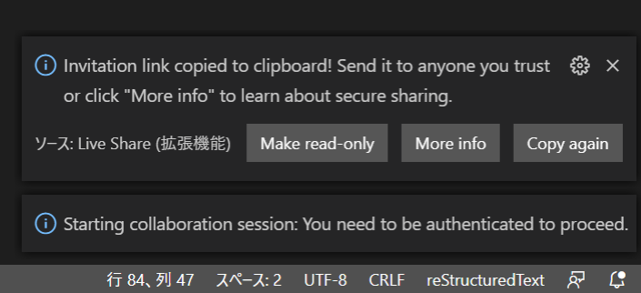

========================
VSCodeとLive Shareの設定
========================

VS Codeの設定
================================

VS CodeでPythonを扱ったことがない方、初めてVS Codeを利用する方の設定を説明します。

またLive Shareの設定方法も説明します。

利用する拡張機能
================================

このチュートリアル作成中に利用した拡張機能を紹介します。

- `Python - Visual Studio Marketplace <https://marketplace.visualstudio.com/items?itemName=ms-python.python>`_
- `reStructuredText - Visual Studio Marketplace <https://marketplace.visualstudio.com/items?itemName=lextudio.restructuredtext>`_

ワークスペースの設定
================================

VS Codeにはワークスペースという概念があります。

.. todo:: ワークスペースの公式ヘルプ

Python拡張機能にも専用の設定があり、ワークスペース内で設定を行うことで＊＊＊

``.vscode/settings.json`` に以下の設定を追加します。

.. code-block:: json

  {
    "python.formatting.provider": "black",
    "editor.formatOnSave": true,
    "python.linting.pylintEnabled": false,
    "python.linting.flake8Enabled": true,
    "python.linting.enabled": true,
  }

この設定は、いくつかのPythonパッケージの依存があります。これらはpip経由でインストール可能で、「prepare」の仮想環境作成時にインストールされます。

.. todo:: 環境構築のpipインストール部分のリンクを作成する

- `psf/black: The uncompromising Python code formatter <https://github.com/psf/black>`_
- `PyCQA / flake8 · GitLab <https://gitlab.com/pycqa/flake8>`_

Live Shareによるチュートリアルサポート
================================================================

Visual Studio Live Shareは、Visual StudioやVS Codeでソースコードをリアルタイムに複数人で共有、編集しデバッグをすることが出来ます

`概要 - Visual Studio Live Share - Visual Studio Live Share | Microsoft Docs <https://docs.microsoft.com/ja-jp/visualstudio/liveshare/>`_

チュートリアルでは、各参加者のVS Codeの状況を講師, TAがリアルタイムでコードのデバッグを手助けできます。

この章ではサポートを受けたい方向けに、Live Shareのセットアップ方法を紹介します。

Live Shareは参加者のVS Codeの状況を講師、TAがリアルタイムで見ることができ、操作して共同で作業が可能です。

LiveShare拡張のインストール
--------------------------------------------------------------

ストアからインストール出来ます。

`Live Share - Visual Studio Marketplace <https://marketplace.visualstudio.com/items?itemName=MS-vsliveshare.vsliveshare>`_

セッションの作成
------------------------------------------------------------

各参加者皆さんのVSCodeでLiveshareのセッションを講師とTAが参加する必要があり、その時に必要な招待URLを教えてもらう必要があります。

`セキュリティ-Visual Studio Live Share - Visual Studio Live Share | Microsoft Docs <https://docs.microsoft.com/ja-jp/visualstudio/liveshare/reference/security>`_

インストールすると、自動的にWelcomeタブが表示されますが閉じてもらって構いません

ウィンドウ↓の Live Shareマークをクリックして、GitHubアカウントでログインします。

.. image:: ./doc-img/vscode_1.png
.. image:: ./doc-img/vscode_2.png

その後自動的にコラボレーションセッションがスタートします。自動的にクリップボードに招待リンク（URL）がコピーされるので控えてください。

最後に講師にURLを伝えてください。伝え方はチュートリアル当日に方法をお伝えします。

URLをブラウザで開くとこのようにブラウザでの参加方法が表示されます。

.. image:: ./doc-img/vscode_4.png

.. todo:: 2020-08-16

  - コラボレーションセッションスタート時にRead-Onlyにして、そのあとに書き込み許可できるか調べてみる
  - 招待リンクの有効期限、コラボレーションセッションがどのぐらいの時間まで有効かを調べる
  - （招待リンクは何度も参加可能かを調べる）

チュートリアル当日の流れ
================================

当日は 8/30 9:30 から環境構築の相談時間を設けます。その時に「セッションの作成」の作業をしてもらい、コラボレーションの招待リンクを伝えてください。

